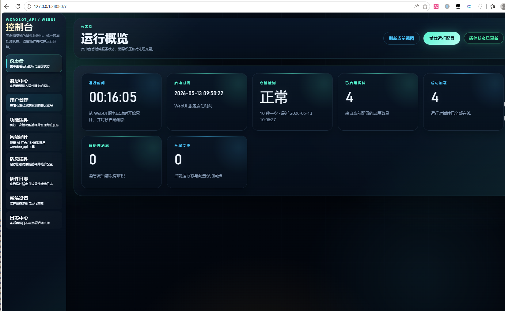
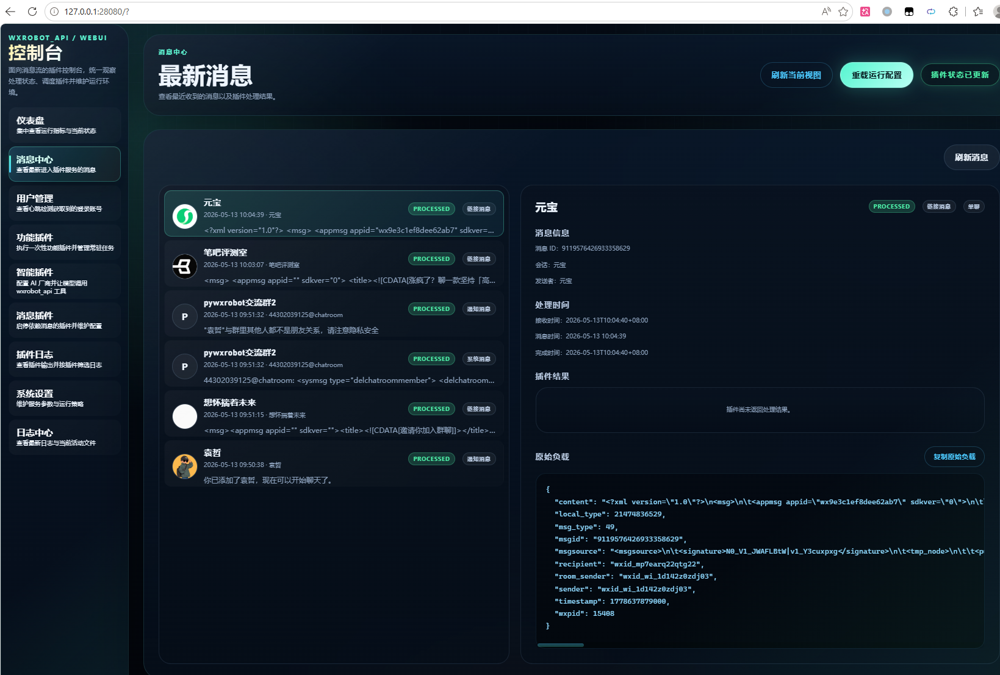
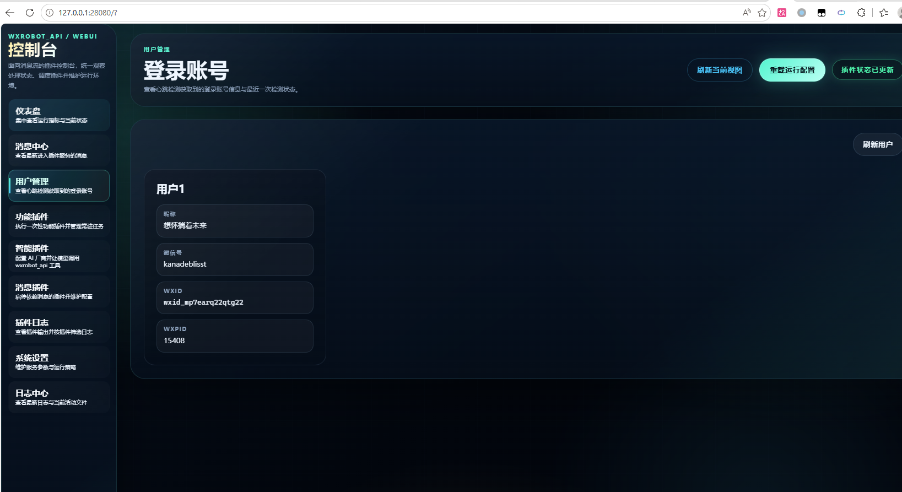
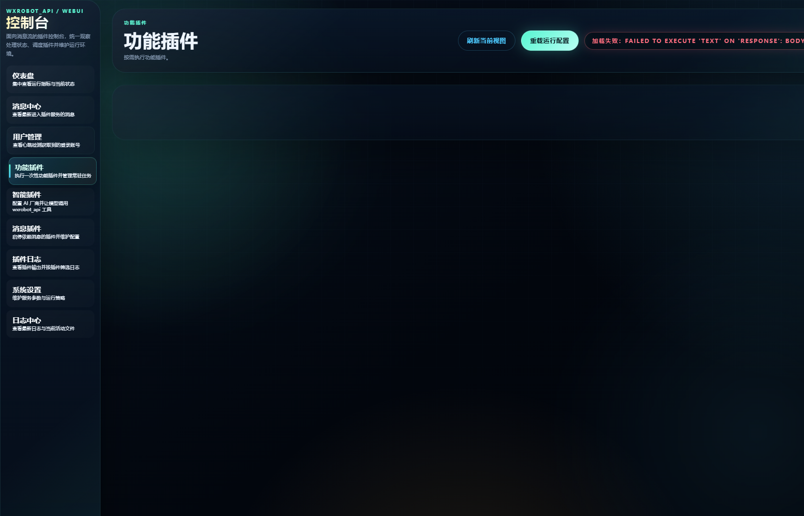
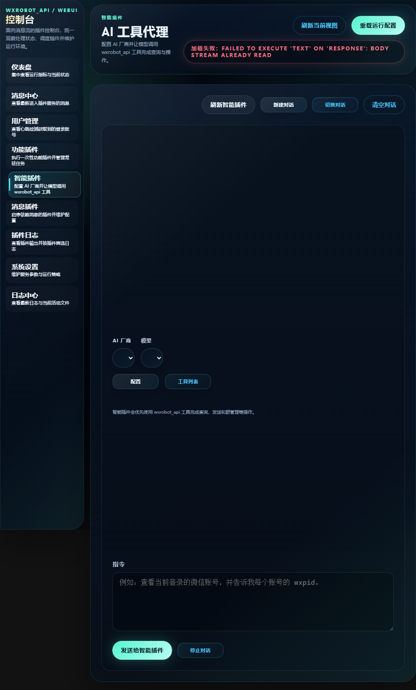
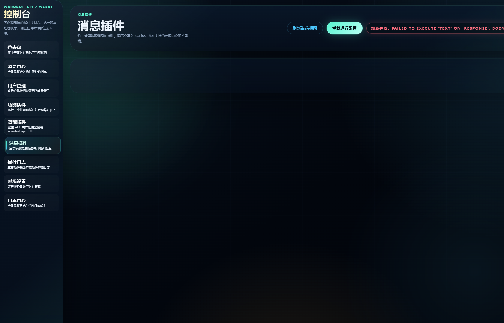
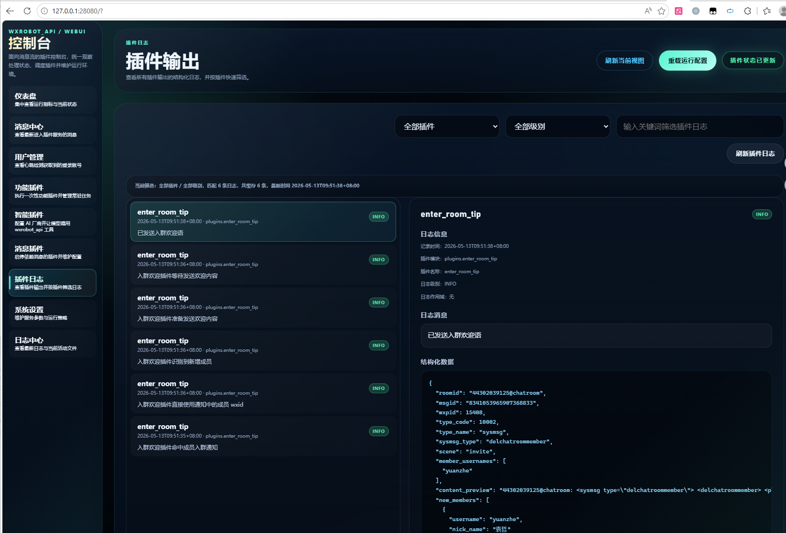
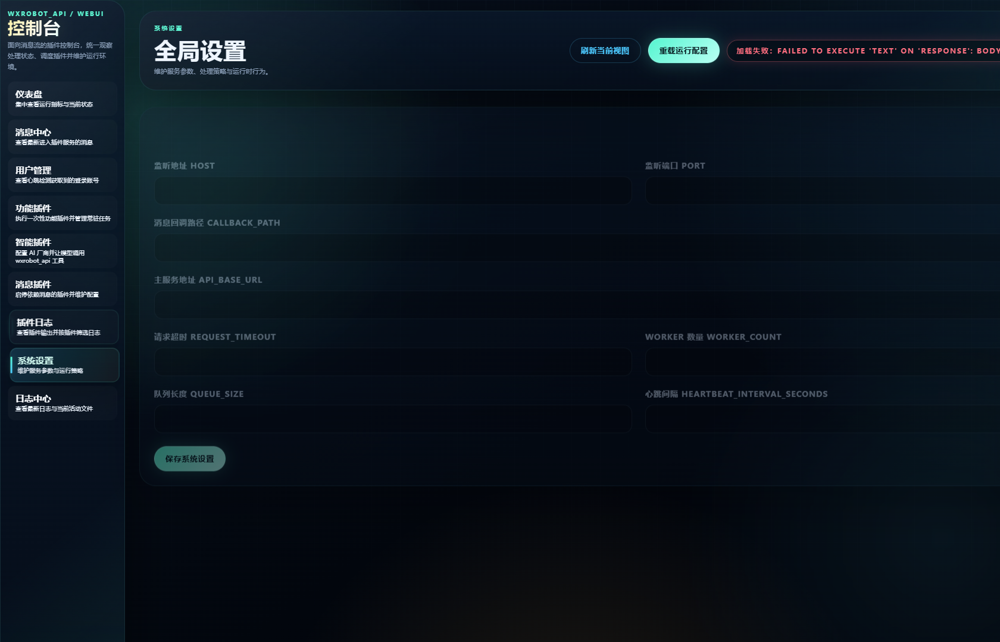
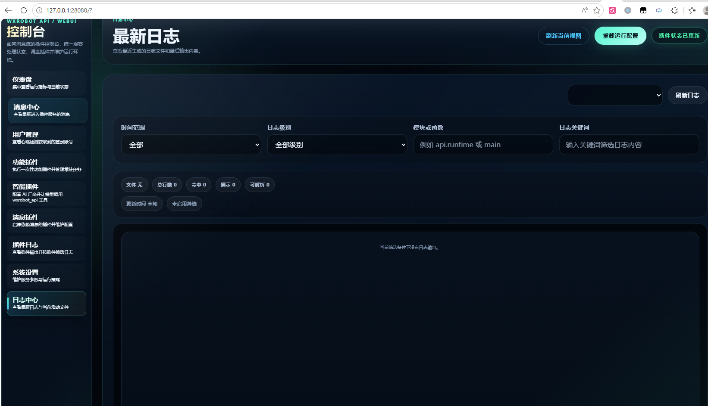

# wxrobot_webui

wxrobot_webui 是面向 pywxrobot4 的 Web 控制台与插件运行时。它提供消息回调接入、异步插件调度、结构化插件配置、AI 工具代理、导出类功能插件和运行日志查看能力。

完整文档已经整理到 [docs/README.md](docs/README.md)。如果你要部署、运营或开发插件，建议直接从这里开始：

- [文档总览](docs/README.md)
- [快速开始](docs/getting-started.md)
- [控制台说明](docs/console-guide.md)
- [插件系统](docs/plugins.md)
- [智能插件](docs/ai-assistant.md)
- [开发指南](docs/development.md)
- [架构与性能优化](docs/optimizations.md)

## 基础说明

- 服务启动入口：`python main.py`
- 默认访问地址：`http://127.0.0.1:28080/`
- 默认消息回调路径：`/messages`
- 默认 pywxrobot4 地址：`http://127.0.0.1:23235`

## 页面截图

### 仪表盘

### 消息中心

### 用户管理

### 功能插件

### 智能插件

### 消息插件

### 插件日志

### 系统设置

### 日志中心

